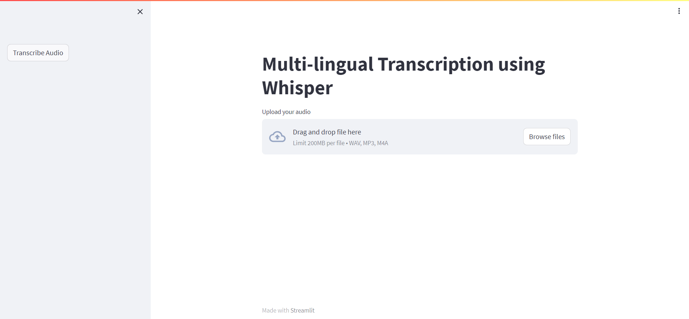

# 🤖 AI Toolbox

AI Toolbox is a powerful, all-in-one web application that brings together AI-powered tools for chat, transcription, and content analysis. Built with Streamlit, it leverages OpenAI's Whisper for audio/video processing and Ollama for local language model interactions.



## ✨ Features

### 💬 Ollama Chat
Engage in intelligent conversations with local LLMs through an intuitive chat interface.
- **Stream responses** in real-time
- **Adjustable temperature** for response creativity
- **Clear chat history** functionality
- **Multiple model support** (llama3, mistral, codellama, etc.)

### 🎙️ Audio Transcription & Summarization
Transcribe and summarize audio files in 90+ languages with AI assistance.
- **Multi-language support** with automatic detection
- **Customizable prompts** for summarization
- **Download transcriptions** and summaries
- **Supports WAV, MP3, and M4A** formats

### 🌐 Website Content Summarizer
Extract and summarize content from any public webpage.
- **AI-powered summarization** of articles and blogs
- **Article metadata extraction** (title, authors, keywords)
- **URL security validation** (prevents SSRF attacks)
- **Content statistics** and insights

### 📝 Video Subtitle Generator
Automatically generate industry-standard SRT subtitle files from videos.
- **Automatic language detection**
- **Precise timing** for each subtitle segment
- **Download ready-to-use SRT files**
- **Supports MP4 and MOV** formats

## 🚀 Quick Start

### Prerequisites

- **Python 3.10-3.13** (Python 3.14+ not yet supported by some dependencies)
- **FFmpeg** for audio/video processing
- **Ollama** for LLM inference

### Installation

1. **Clone the repository:**
   ```bash
   git clone https://github.com/yourusername/ai-toolbox.git
   cd ai-toolbox
   ```

2. **Create and activate a virtual environment:**
   ```bash
   python3 -m venv venv
   source venv/bin/activate  # On Windows: venv\Scripts\activate
   ```

3. **Install Python dependencies:**
   ```bash
   pip install -r requirements.txt
   ```

4. **Install FFmpeg:**
   - **Ubuntu/Debian:** `sudo apt-get install ffmpeg`
   - **macOS:** `brew install ffmpeg`
   - **Windows:** Download from [FFmpeg website](https://ffmpeg.org/download.html)

5. **Install and set up Ollama:**
   ```bash
   # macOS/Linux
   curl -fsSL https://ollama.com/install.sh | sh

   # Pull a model (e.g., llama3)
   ollama pull llama3

   # Start Ollama server
   ollama serve
   ```

   Visit [Ollama's website](https://ollama.com/) for Windows installation.

6. **Configure environment variables:**
   ```bash
   cp .env.example .env
   # Edit .env with your preferred settings
   ```

### Running the Application

```bash
streamlit run main.py
```

The application will open in your default browser at `http://localhost:8501`

## ⚙️ Configuration

Edit the `.env` file to customize your setup:

```env
# Ollama Model (check available models: ollama list)
MODEL_NAME=llama3

# Whisper Model (tiny, base, small, medium, large)
WHISPER_MODEL=base

# API Configuration (for future use)
OPENAI_URL=http://localhost:11434/v1
OPENAI_API_KEY=ollama
```

### Whisper Model Selection Guide

| Model | Speed | Accuracy | Use Case |
|-------|-------|----------|----------|
| tiny | ⚡⚡⚡⚡ | ⭐⭐ | Quick drafts, testing |
| base | ⚡⚡⚡ | ⭐⭐⭐ | **Recommended** - Best balance |
| small | ⚡⚡ | ⭐⭐⭐⭐ | Better accuracy needed |
| medium | ⚡ | ⭐⭐⭐⭐⭐ | Professional use |
| large | 🐌 | ⭐⭐⭐⭐⭐ | Maximum accuracy |

## 📖 Usage Guide

### 💬 Chat with LLMs
1. Navigate to the **Ollama Chat** tab
2. Configure model and temperature in the sidebar
3. Type your message and press Enter
4. Clear chat history anytime with the "Clear Chat" button

### 🎙️ Transcribe & Summarize Audio
1. Go to **Audio Summary** tab
2. Upload an audio file (WAV, MP3, or M4A)
3. Customize the system prompt (optional)
4. Click "Transcribe & Summarize"
5. Download transcription and summary

### 🌐 Summarize Websites
1. Open **Website Summary** tab
2. Enter a public HTTP/HTTPS URL
3. Click "Summarize Website"
4. Review summary and article metadata
5. Download summary as text file

### 📝 Generate Video Subtitles
1. Switch to **Subtitle Creation** tab
2. Upload a video file (MP4 or MOV)
3. Click "Generate Subtitles"
4. Preview and download SRT file
5. Use in video editors or players

## 🌍 Supported Languages

Whisper supports 90+ languages including:
- **European:** English, Spanish, French, German, Italian, Portuguese, Dutch, Polish, Russian
- **Asian:** Chinese, Japanese, Korean, Hindi, Arabic, Hebrew, Turkish
- **And many more:** See full list in [Whisper documentation](https://github.com/openai/whisper)

## 🔒 Security Features

- ✅ **URL validation** prevents SSRF attacks
- ✅ **Temporary file cleanup** ensures privacy
- ✅ **Local processing** - no data sent to external servers
- ✅ **Environment variable protection** via .gitignore
- ✅ **Input sanitization** and error handling

## 🛠️ Troubleshooting

### Ollama Connection Issues
```bash
# Check if Ollama is running
curl http://localhost:11434/api/tags

# Start Ollama if not running
ollama serve

# List available models
ollama list
```

### FFmpeg Issues
```bash
# Verify FFmpeg installation
ffmpeg -version

# If not found, install it
# macOS: brew install ffmpeg
# Linux: sudo apt-get install ffmpeg
```

### Python Version Issues
Some dependencies (like numba) don't support Python 3.14 yet. Use Python 3.10-3.13:
```bash
# Check Python version
python --version

# Use pyenv to manage versions if needed
pyenv install 3.13.0
pyenv local 3.13.0
```

### Import Errors
```bash
# Ensure all dependencies are installed
pip install -r requirements.txt

# If issues persist, try upgrading pip
pip install --upgrade pip
```

## 📦 Dependencies

- **streamlit** - Web application framework
- **openai-whisper** - Audio transcription
- **ollama** - Local LLM inference
- **newspaper4k** - Web content extraction
- **lxml[html_clean]** - HTML parsing
- **python-dotenv** - Environment configuration
- **torch** - Deep learning backend

## 🤝 Contributing

Contributions are welcome! Please follow these steps:

1. Fork the repository
2. Create a feature branch (`git checkout -b feature/amazing-feature`)
3. Commit your changes (`git commit -m 'Add amazing feature'`)
4. Push to the branch (`git push origin feature/amazing-feature`)
5. Open a Pull Request

## 📄 License

This project is licensed under the MIT License - see the [LICENSE](LICENSE) file for details.

## 🙏 Acknowledgments

- [OpenAI Whisper](https://github.com/openai/whisper) - State-of-the-art speech recognition
- [Ollama](https://ollama.com/) - Run LLMs locally with ease
- [Streamlit](https://streamlit.io/) - Beautiful web apps for ML/AI
- [newspaper4k](https://github.com/codelucas/newspaper) - Article extraction and parsing

## 📞 Support

If you encounter any issues or have questions:
- Open an [issue](https://github.com/yourusername/ai-toolbox/issues)
- Check existing issues for solutions
- Review the troubleshooting section above

---

**Made with ❤️ using Streamlit, Ollama & Whisper**
